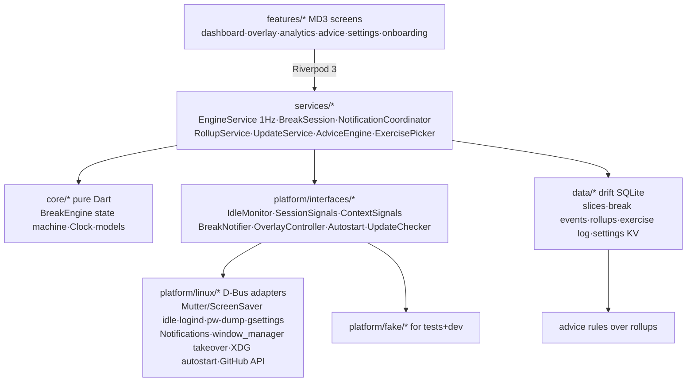

# BreakTime — Knowledge Graph

## 1. Project Abstract
BreakTime (`com.xernai.breaktime`, brand: Xernai) is a free, GPLv3, Linux-first (Fedora Tier-1) break-reminder and digital-wellbeing desktop app in Flutter/Material 3. Situation-aware scheduling (meeting deferral, natural-break credit, pre-break warnings, strict snooze budget) + Wayland-native reliability, with fully local screen-time analytics and rule-based advice. Distribution: GitHub Releases (AppImage + RPM) + github.io site; COPR post-1.0; Flathub blocked by its 2026 AI policy.

## 2. Architecture Graph (Mermaid)

## 3. Module Map
- `lib/core/` — pure-Dart break engine (state machine, monotonic clock, config, models). No Flutter/IO imports; the correctness core (24 tests).
- `lib/platform/interfaces/` — the macOS-port seam; `linux/` D-Bus/XDG/process adapters; `fake/` deterministic test doubles.
- `lib/services/` — orchestration: 1 Hz EngineService tick, break session (exercise pick + window takeover + logging), notifications, rollups, updates, advice rules, exercise picker.
- `lib/data/` — drift schema + repositories (slices, break events, rollups, exercise log, settings KV incl. engine snapshot).
- `lib/features/` — MVVM screens; `lib/app/` — theme tokens, shell, bootstrap wiring.
- `assets/linux/` — desktop entry, AppStream metainfo, SVG icon. `packaging/` — AppImage script + RPM spec. `site/` — github.io landing page. `.github/workflows/` — ci / release / pages.

## 4. Design Decisions
- **2026-07-12 — Product**: two-tier breaks (20-20-20 micro + long), snooze budget→strict overlay with logged 3s hold-to-escape, illustrated exercises, natural-break credit, busy deferral (mic/cam via pw-dump, DND via gsettings) capped 15 min, 30s pre-warn, work hours/days. Top-bar ticker dropped (annoyance + GNOME-extension cost).
- **2026-07-12 — License/distribution**: GPLv3 + trademark on names; DCO for contributions (preserves dual-licensing for future paid Mac build); single public repo; GitHub Releases + COPR later; no Flathub (their AI-code ban, May 2026); site on github.io → move to Cloudflare Pages when Mac sales start (GitHub Pages forbids selling).
- **2026-07-13 — Engine**: deterministic 1Hz-ticked pure-Dart state machine; monotonic clock only for intervals (wall clock only for work-hours/persistence); defer cap measured from immutable cycle-due; deferral exits the moment busy clears; away spans remember lock vs idle; short re-warn after any delayed break; crash-safe wall-clock snapshot restore.
- **2026-07-13 — Riverpod 3 API changes** (from training-data 2.x): `Override` type no longer exported → override lists must stay inferred literals (bootstrap returns instances; helpers build ProviderScope internally). Private named initializing formals (`required this._x`) now valid Dart.
- **2026-07-13 — Test infra**: widget tests use TestHarness (real engine + in-memory drift + fakes). Drift in FakeAsync: never `db.close()` in widget tests (deadlock) and flush unmount timers via `cleanupHarness` as the last body line. AnimationController status listener proved unreliable for completion detection → value listener; GestureDetector needed `HitTestBehavior.opaque` (real bug caught by test).
- **2026-07-13 — Illustrations**: code-drawn CustomPainter animations (theme-aware, GPL-clean, tiny) instead of Lottie/Rive assets.
- **2026-07-13 — Packaging**: AppImage (primary, any distro) + binary RPM from CI bundle (from-source COPR spec = post-1.0); metainfo + desktop + SVG icon in hicolor; release workflow on `v*` tags runs tests → bundle → AppImage + RPM → GitHub Release.
- **Deferred**: wlroots idle (ext-idle-notify-v1 needs native code), fullscreen-app detection (X11-only anyway), weekly advice digest notification, multi-monitor overlay (verify Flutter multi-window API first), dynamic color from wallpaper, COPR from-source spec, Flathub (revisit under their mature-project carve-out someday).

## 5. Current State
- **M0–M4 code complete**: engine, data, adapters, overlay+exercises, analytics+advice, updates+autostart, packaging+site+workflows. 71 tests green, `flutter analyze --fatal-infos` clean.
- **Pending user action**: `sudo dnf install clang ninja-build gtk3-devel` to build/run locally (unit tests don't need it); then run docs/qa-checklist.md on GNOME Wayland.
- **Before first public release**: create the GitHub repo (name in `lib/app/version.dart` `githubRepoSlug` must match!), push, enable Pages (workflow), tag `v0.1.0`. Consider renaming ("BreakTime" is a crowded name) before any paid Mac work.
- No git remote yet; 7 local commits on main.
