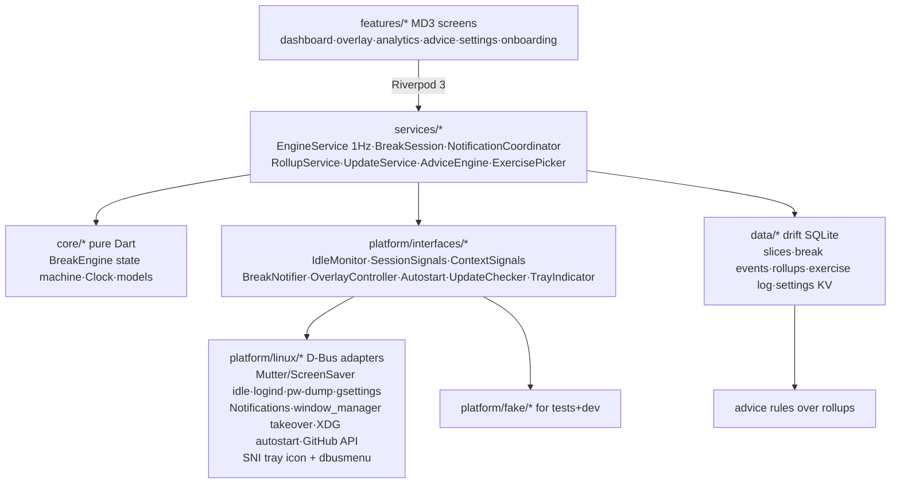

# RestifEye — Knowledge Graph

## 1. Project Abstract
RestifEye (`com.xernai.restifeye`, brand: Xernai) is a free, source-available (PolyForm Shield 1.0.0), Linux-first (Fedora Tier-1) break-reminder and digital-wellbeing desktop app in Flutter/Material 3. Situation-aware scheduling (meeting deferral, natural-break credit, pre-break warnings, strict snooze budget) + Wayland-native reliability, with fully local screen-time analytics and rule-based advice. Distribution: GitHub Releases (AppImage + DEB + RPM) + GitHub Pages site; COPR post-1.0; Flathub blocked by its 2026 AI policy.

## 2. Architecture Graph (Mermaid)

## 3. Module Map
- `lib/core/` — pure-Dart break engine (state machine, monotonic clock, config, models) and the tray-mood rules (`mood/`: `MoodWindow` evidence selection + storage format, `computeMood` rules, `MoodTracker` hysteresis). No Flutter/IO imports; the correctness core.
- `lib/platform/interfaces/` — the macOS-port seam; `linux/` D-Bus/XDG/process adapters; `fake/` deterministic test doubles.
- `lib/services/` — orchestration: 1 Hz EngineService tick, break session (exercise pick + window takeover + logging), notifications, rollups, updates, advice rules, exercise picker.
- `lib/data/` — drift schema + repositories (slices, break events, rollups, exercise log, settings KV incl. engine snapshot).
- `lib/features/` — MVVM screens; `lib/app/` — theme tokens, shell, bootstrap wiring.
- `assets/linux/` — desktop entry, AppStream metainfo, SVG icon. `packaging/` — AppImage script + RPM spec + DEB script. `site/` — landing page (GitHub Pages); `site/fonts/` holds the self-hosted OFL woff2 files, no CDN. `.github/workflows/` — ci / release (AppImage+DEB+RPM) / pages. `docs/INSTALL.md` — novice-friendly install guide (all 3 formats + build-from-source).

## 4. Design Decisions
- **2026-07-12 — Product**: two-tier breaks (20-20-20 micro + long), snooze budget→strict overlay with logged 3s hold-to-escape, illustrated exercises, natural-break credit, busy deferral (mic/cam via pw-dump, DND via gsettings) capped 15 min, 30s pre-warn, work hours/days. Top-bar ticker dropped (annoyance + GNOME-extension cost).
- **2026-07-12 — License/distribution**: PolyForm Shield 1.0.0 + trademark on names; DCO for contributions (preserves dual-licensing for future paid Mac build); single public repo; GitHub Releases + COPR later; no Flathub (their AI-code ban, May 2026); site on GitHub Pages. **Clarified 2026-08-10**: NOT open source in marketing — free for Linux, paid Mac/Windows planned. Source-available on GitHub but do not label as OSS. **Changed 2026-08-10**: License switched from GPLv3 to PolyForm Shield 1.0.0. GPLv3 cannot restrict commercial use — anyone could fork and sell it. PolyForm Shield allows all use (including at work) but prohibits creating competing products from the source. Licensor (Xernai) retains full rights as copyright holder to sell Mac/Windows builds. `Licensor Line of Business` clause protects the product category. Vercel config removed — hosting on GitHub Pages only.
- **2026-07-13 — Engine**: deterministic 1Hz-ticked pure-Dart state machine; monotonic clock only for intervals (wall clock only for work-hours/persistence); defer cap measured from immutable cycle-due; deferral exits the moment busy clears; away spans remember lock vs idle; short re-warn after any delayed break; crash-safe wall-clock snapshot restore.
- **2026-07-13 — Riverpod 3 API changes** (from training-data 2.x): `Override` type no longer exported → override lists must stay inferred literals (bootstrap returns instances; helpers build ProviderScope internally). Private named initializing formals (`required this._x`) now valid Dart.
- **2026-07-13 — Test infra**: widget tests use TestHarness (real engine + in-memory drift + fakes). Drift in FakeAsync: never `db.close()` in widget tests (deadlock) and flush unmount timers via `cleanupHarness` as the last body line. AnimationController status listener proved unreliable for completion detection → value listener; GestureDetector needed `HitTestBehavior.opaque` (real bug caught by test).
- **2026-07-13 — Illustrations**: code-drawn CustomPainter animations (theme-aware, license-clean, tiny) instead of Lottie/Rive assets.
- **2026-07-13 — Packaging**: AppImage (primary, any distro) + binary RPM from CI bundle (from-source COPR spec = post-1.0); metainfo + desktop + SVG icon in hicolor; release workflow on `v*` tags runs tests → bundle → AppImage + RPM → GitHub Release.
- **2026-08-10 — DEB packaging + website rebuild + install guide**: (1) Added `packaging/deb/build-deb.sh` using `dpkg-deb` — mirrors RPM layout (`/opt/RestifEye`, symlink to `/usr/bin`, desktop+icon+metainfo in XDG paths). `release.yml` now builds AppImage+DEB+RPM and attaches all three. (2) Website (`site/`) rebuilt as premium landing page: separated CSS (`style.css`), scroll-reveal animations, gradient orb hero, glassmorphism cards, **direct download** via GitHub Releases API (JS fetches latest release assets and populates buttons with direct URLs + file sizes — no redirect to GitHub). 3 format cards (AppImage/DEB/RPM). No Google Fonts (system-ui stack). GitHub Pages (`pages.yml`) as deployment. OG image generated for social sharing. (3) `docs/INSTALL.md` — novice-level guide covering all 3 formats + build from source + GNOME tray extension + uninstall + troubleshooting.
- **2026-08-10 — RPM `%{_metainfodir}` macro fix**: `%{_metainfodir}` is a Fedora/RHEL-only macro (from `redhat-rpm-config`). Ubuntu's `rpmbuild` (used in CI) doesn't define it, so it remained as the literal string → created bogus paths and failed the `%files` section with `error: File must begin with "/"`. Fixed by adding `%{!?_metainfodir:%global _metainfodir %{_datadir}/metainfo}` at the top of the spec. This is the standard cross-distro defensive pattern. The DEB and AppImage builds were unaffected (they don't use RPM macros).
- **2026-08-10 — AppImageHub CI failure: GLib 2.80 symbol mismatch**: AppImageHub's test runner is `ubuntu-22.04` (GLib 2.72). `release.yml` used `ubuntu-latest` (now ubuntu-24.04, GLib 2.80+), so the binary exported `g_once_init_enter_pointer` (GLib 2.80) → instant `symbol lookup error` on 22.04. Fix: pin `runs-on: ubuntu-22.04` in `release.yml`. AppImage best practice: always build on the oldest still-supported LTS for maximum portability. Also fixed two `appdir-lint` warnings: (1) added PNG icon at AppDir root (`assets/linux/com.xernai.restifeye.png` → `com.xernai.restifeye.png`) — SVG-only top-level icon fails thumbnail generation; (2) copied `com.xernai.restifeye.metainfo.xml` into `usr/share/metainfo/` inside AppDir — required by AppImageHub for description/license extraction. CI workflow (`ci.yml`) stays on `ubuntu-latest` since it only runs tests (no binary linking).
- **2026-08-15 — GLib shim broke every non-Ubuntu-22.04 build**: the 2026-08-10 compatibility shim guarded on `#ifndef G_APPLICATION_DEFAULT_FLAGS`. That name is an **enum member**, not a macro, so the preprocessor never sees it and the guard fires on *every* GLib — forcing the deprecated `G_APPLICATION_FLAGS_NONE` even on GLib ≥ 2.74, where Flutter's `-Werror -Wdeprecated-declarations` turns it into a hard build failure (reproduced locally on GLib 2.88). Correct guard is the version macro `#if !GLIB_CHECK_VERSION(2, 74, 0)`. General rule: never `#ifndef` an enum member.
- **2026-08-15 — AppImage packaging input moved out of `docs/`**: `build-appimage.sh` read its top-level PNG from `docs/assets/icon-512.png`. `docs/assets/` was later deleted from the repo, so the script's `cp` would have failed under `set -e` and killed the next release before any artifact was attached. The PNG is now a tracked packaging asset at `assets/linux/com.xernai.restifeye.png`, rendered from the sibling SVG (`inkscape -w 512 -h 512`, byte-identical to the old file). Rule: packaging scripts may only read from `assets/` and `packaging/` — `docs/` is not a build input.
- **2026-08-15 — Flutter SDK pinned in CI**: both workflows used `channel: stable`, so v0.1.3 shipped on 3.44.9 while local dev ran 3.44.8 — every release was built with an SDK that had never been tested against, and "works locally, broken in the release" could not be ruled out by inspection. Now `flutter-version: 3.44.8` in `ci.yml` and `release.yml`. Bump the pin deliberately, rebuild locally, then tag.
- **2026-08-15 — Site redesigned around an explicit gaze path ("Calm Instrument")**: the 2026-08-10 page was centre-aligned throughout, used emoji as feature icons, and weighted all six feature cards identically — a layout with no reading direction and no ranked message. Rebuilt dark-first on an asymmetric hero (copy left, live product panel right) so the eye runs headline → product proof → CTA, with a bento feature grid whose one 4-column tile marks *meeting deferral* as the differentiator. Decisions worth keeping: **fonts are self-hosted** (`site/fonts/`, latin-subset variable woff2, Instrument Sans + Inter + JetBrains Mono, ~110 KB, OFL notice bundled) — a Google Fonts `<link>` was rejected because a page whose headline claim is "no telemetry" must not ping a third party to render; **all icons are an inline SVG `<symbol>` sprite**, no emoji; **the seven tray moods are rebuilt in SVG from `lib/app/tray_face.dart`'s exact geometry** (same arc endpoints, same 4% inset, same eye/mouth shapes) so the site and the app can never drift; **the comparison table names Stretchly, Workrave and Safe Eyes** with a "last checked July 2026" stamp — re-verify before each release. Three bugs the headless-Firefox render caught that review had not: `format('woff2-variations')` is unsupported widely enough that all three `@font-face` rules were being dropped to system fonts (use plain `format('woff2')` — variable axes still work); `display:flex` on the note paragraphs turned every text node *and the inline `<a>`* into separate flex items, scrambling the sentence (wrap prose in a single `` before flexing); and a `
` progress bar was a direct child of `<ol>`, which only admits `<li>`. Scroll-reveal now hides content only under `:root.js`, added by an inline head script, so a JS failure can no longer leave most of the page invisible.
- **2026-08-15 — Site second pass: prose replaced with diagrams**: the first pass still read as an essay (1,577 visible words). Cut to 703 by deleting every explanatory paragraph and drawing the same claim instead — deferral is now a `Mic · Camera · DND · Video → Break` track with the 15:00 cap under it; natural-break credit is `Walked away / Locked / Suspended → Counted`; "24 exercises across 3 tiers" is literally 24 dots in 3 rows of 8; the notification feature shows the notification; weekly advice shows a seven-bar week. The comparison table's prose cells became ✓ / – / ✗ pills with a two-word label, which is what makes RestifEye's column read as a solid run of green at a glance. The four-step "how it works" list became a horizontal journey rail. **Rule for future edits: if a sentence describes a mechanism, draw the mechanism.** Also: hero CTA now scrolls to `#download` rather than firing the AppImage download directly (the size badge came off with it — a button that doesn't download must not advertise a file size); Discord (`discord.gg/sXVwRSqhaj`) and X (`x.com/Xern_AI`) added to the footer, the closing CTA, `twitter:site` and the JSON-LD `sameAs`. `site/og.png` regenerated from `site/og-source.html` — that file is the template, rendered with `firefox --headless --window-size=1200,630 --screenshot`; it must stay in `site/` because it loads `icon.svg` and `fonts/` relatively. Regenerate it whenever the headline or brand colours change.
- **2026-08-15 — Version is read from the bundle, not hand-kept**: `appVersion` was `const '0.1.0'` with a "keep in sync when tagging" comment. It drifted — releases reached 0.1.3 while the app still identified as 0.1.0, so the weekly update check compared against a version that never shipped and would have notified forever. Now `loadAppVersion()` reads `data/flutter_assets/version.json` (Flutter generates it from `pubspec.yaml` on every build) from beside `Platform.resolvedExecutable`, called first thing in `bootstrap()`. Filesystem read, not `rootBundle`: `version.json` is written beside the assets and is not an asset-manifest entry — this is the same path `package_info_plus` uses on Linux, and it resolves inside an AppImage mount and through the `/usr/bin` → `/opt` symlink in the DEB/RPM. Failure is non-fatal (falls back to `0.0.0`, which can only under-report). Settings → About now shows `version (build N)`. Bumping `pubspec.yaml` is the only step.
- **Deferred**: wlroots idle (ext-idle-notify-v1 needs native code), fullscreen-app detection (X11-only anyway), weekly advice digest notification, multi-monitor overlay (verify Flutter multi-window API first), dynamic color from wallpaper, COPR from-source spec, Flathub (revisit under their mature-project carve-out someday).

- **2026-07-13 — First live-test fixes (user QA round 1)**:
  - *Single instance*: runner used the Flutter template's `G_APPLICATION_NON_UNIQUE` → every app-drawer launch spawned a full new process (4 windows / 4 warning notifications / 4 overlays / breaks-taken ×4). Fixed with default GApplication flags + present-existing-window in `activate`. This one root cause explained the entire "4×" bug report.
  - *Notification-first controls*: Snooze removed from the overlay (defeats snooze's purpose once the screen is taken); warning notification now has Start now / Snooze / Skip. New `BreakEngine.skip()` with `skipBudget` (default 2 **consecutive** skips, reset on completed/credited break, configurable 0–3 in Settings). New `BreakAction.skipped` (drift intEnum — append-only). Skips deliberately NOT in DailyRollups (schema untouched); revisit if advice rules want skip pressure.
  - *Fullscreen optional*: `flagFullscreenOverlay` (settings KV, default on) → `OverlayController.enterBreak(strict:, fullscreen:)`. Strict breaks always fullscreen. Kept out of `BreakConfig` because `updateConfig` restarts engine timers — presentation flags must not reset schedules.
  - *Tray*: hand-rolled StatusNotifierItem + com.canonical.dbusmenu over the `dbus` package (`platform/linux/sni_tray.dart`) because ayatana-appindicator dev libs aren't a build dep we want (tray_manager needs them; keeps AppImage dependency-free). Icon = ARGB32 pixmaps decoded at runtime from bundled PNGs (`app/tray_icons.dart`). Menu: Open/Pause/Quit; re-registers on watcher restart. GNOME requires AppIndicator extension — documented on site + QA list. `main.dart` now uses ProviderContainer + UncontrolledProviderScope so tray actions can drive `pausedProvider`.
  - *Autostart default-on*: applied once at bootstrap behind `flagAutostartApplied` (never re-forces after user opt-out; skipped in dev mode). One-time "still running in background" notification on first window-hide (`flagHideNoticeShown`).
  - *Dashboard*: `Monitoring` phase now carries `microIn`+`longIn`; card shows the other timer as a secondary line ("Eye break folds into the long break" when merged).
  - 75 tests green (was 71), analyze --fatal-infos clean, release build OK. Landing page rebuilt (sticky nav, hero mock, steps, FAQ, a11y/reduced-motion, dark/light).

- **2026-07-14 — Second live-test round (user QA round 2). Two engine bugs explained four symptoms:**
  - *The trapped user (P0)*: `_trackAway` ran **during** breaks. A movement break is meant to get you off the keyboard, so idling past `idleFireThreshold` made `_resolveAwaySpan` credit an away span **from inside the break** → `_finishCycle` ran, the `inBreak` tick case never did, `BreakCompleted` never fired, and `BreakSessionNotifier` (which only exited the overlay on Completed/Escaped/Snoozed) never released the window. Result: fullscreen + always-on-top + `_inBreak` swallowing `onWindowClose` = an app you cannot quit. Fixed by suspending away-tracking while `inBreak`.
  - *No Snooze button / surprise strict breaks*: the snapshot-restore constructor path never seeded `_snoozesLeft`, leaving it 0. Since `_strictNow = _snoozesLeft <= 0 && strictMode`, **the first break after every login was strict** and its notification carried no Snooze action. Budgets are per-cycle and not persisted, so they are now seeded on every construction path.
  - *Double-credited rest (found by the new test)*: the idle clock runs through a break the user sat out, so backdating `now - idle` measured the break itself as a fresh away span and credited a second break on their return. Added `_awayFloor` — an away span may never be backdated before the last break/pause ended.
- **2026-07-14 — Overlay is now level-triggered, not edge-triggered.** `OverlayController` went from `enterBreak`/`exitBreak` commands to a single idempotent `apply(BreakWindowState)`, driven by `overlayReconcilerProvider` off the engine's 1 Hz **phase** stream. Rationale: any break-ending path that failed to emit the exact expected event stranded the window forever, and two `unawaited` calls could interleave so a late `enterBreak` re-fullscreened *after* an `exitBreak` (leaving `_tookFullscreen=false` while actually fullscreen — unrecoverable). All window mutations now go through one serialized queue; `_current` only advances on success, so a failed transition self-heals on the next tick. Escape hatches added (`Esc` when no break, `Ctrl+Q` always) via a shared `AppLifecycle`.
- **2026-07-14 — Notifications**: `Notify`/`CloseNotification` were fire-and-forget, so a dismiss could overtake the show whose reply carried the id to dismiss → the notification was orphaned, and the next cycle passed its **dead id** as `replaces_id`, making the daemon write into a destroyed slot instead of raising a banner (the "eye break notification doesn't always show" report). Now serialized through one queue, plus a `NotificationClosed` subscription that zeroes `_activeId` so a dead id is never reused. Urgency deliberately stays **normal** (user's call: informational, not an alarm). Still exactly one live notification, still replaced in place within a cycle.
- **2026-07-14 — Sounds** (`SoundPlayer` seam, `LinuxSoundPlayer`): `canberra-gtk-play` → `paplay`/`pw-play` → silent, probed once and cached. No audio plugin, so the AppImage stays dependency-free — same reasoning as the hand-rolled SNI tray. Sound is deliberately *one* mechanism: the D-Bus `sound-name` hint was dropped so there is a single Settings toggle and no two states to drift apart.
- **2026-07-14 — Tray, resolved**: never a code bug. GNOME has shipped no status area since 3.26; the top-right corner is only reachable via a shell extension hosting SNI, so our correct SNI item was drawn by nobody. `GnomeTraySupport` now detects the missing `org.kde.StatusNotifierWatcher`, names the exact extension in Settings, and enables/installs it over `org.gnome.Shell.Extensions` D-Bus on an explicit click. `Brand` (`lib/app/brand.dart`) centralises the app name/id for the pending rename.
- **2026-07-14 — Dev-mode config was untestable**: `micro=1min, long=3min` with a 2-min merge window meant `longDue <= microDue + 2` always held → **eye breaks never fired standalone in dev mode**. Long interval moved to 6 min.
- **2026-07-14 — Timed pause**: `setPausedByUser(bool, {DateTime? until})` with wall-clock auto-resume (wall, not monotonic — "2 hours" means 2 hours of the user's life, across suspend). Presets 30m/1h/2h/3h/indefinite on the Dashboard; persisted so a restart cannot strand you paused.
- **2026-07-14 — Stats**: `computeSliceStats` summed only `active` and **discarded the idle/locked slices it was already recording every second**. Now surfaces idle, away, at-computer, active ratio, and workday span. Drift `schemaVersion` 1→2 with an additive `onUpgrade` (defaults, nullable) so existing history survives.
- **2026-07-14 — Site**: `<section class="wrap">` + `.wrap { padding: 0 24px }` — `.wrap` (0,1,0) outranks `section` (0,0,1), so the **section vertical padding had been silently zeroed all along**; that was the reported "bad margins". Fixed with `padding-inline`/`padding-block` longhands so the rules no longer collide. `site/icon.svg` had a 6.25% transparent inset baked into its viewBox (artwork at 8..120 of a 0..128 canvas), making the mark render small and misaligned — viewBox cropped to `8 8 112 112`. Headings no longer inherit the body's 1.65 prose leading; the synthetic 650 weight is gone.

- **2026-07-15 — Dashboard stats frozen on launch day (user QA round 3)**: "breaks taken stuck on 57 / away == at computer" was one bug with a coincidence on top. `todaySliceStatsProvider`/`todayBreakCountsProvider` (and the analytics/advice range providers) captured `DateTime.now()` **once at provider creation**, so an app left running past midnight showed the launch day's totals forever — 57 was exactly Jul 14's `completed 31 + credited 26`, and Jul 14's at-computer (42 205 s) vs away (42 195 s) both happened to format as "11h 43m". Fixes: (1) `todayProvider` — self-invalidating provider of the local calendar day, re-checked by a 30 s periodic timer (deliberately not one timer aimed at midnight: monotonic timers stall across suspend and would fire hours late); `wallClockProvider` (`DateTime Function()`) is its test seam. All four date-scoped providers now watch it. (2) `watchSliceStats` selects slices **overlapping** the day and clips them to it — the old `startAt`-only filter credited a midnight/suspend-spanning slice wholly to the day it began, silently stealing hours from the next day (affected rollups too, same query). 99 tests green. `fake_async` promoted to a direct dev dependency (timer tests import it).
- **2026-07-15 — Missing app icon after rename**: not a code bug. The dev machine's `~/.local/share` still held the `com.xernai.breaktime` desktop entry + hicolor SVG (Exec pointing at the deleted `Github/breaktime` clone) and nothing had installed `com.xernai.restifeye.svg`, so every surface (shell, dock, notifications, autostart entry) fell back to the generic icon — dev installs are hand-rolled, only RPM/AppImage install the icon. Fixed by installing the new desktop entry + SVG locally and deleting the stale pair. One repo change: `StartupWMClass` in the desktop asset corrected `RestifEye` → `com.xernai.restifeye`, because the runner calls `g_set_prgname(APPLICATION_ID)` so the window class/app-id is the reverse-DNS id — the old hint named a class no window ever has. **Reminder: after any app-id/binary rename, refresh the manual dev install (desktop entry, hicolor icon, autostart Exec).**

- **2026-07-23 — The break-end crash was ours, and it was the window hide (user QA round 6)**: reported as "the app sometimes crashes after the break ends, this never happened before the last changes". Two coredumps, identical stacks: `wl_proxy_get_version` ← `gdk_wayland_window_get_egl_surface` ← `gdk_cairo_draw_from_gl` ← the GTK draw handler ← `gdk_frame_clock_paint_idle`. **GTK painted the Flutter GL texture into a window whose Wayland EGL surface had already been freed** — unmapping on Wayland destroys the surface at once, so anything the toolkit still had queued dereferences freed memory. The unmap was the 2026-07-18 "break ends back in the tray" restore. Break end is the one moment a frame is *guaranteed* in flight (the exercise illustration `..repeat()`s, and `setFullScreen(false)` one line earlier adds a resize burst); the months-old `onWindowClose` hide fires from an idle app and never collided. Diagnosed, not guessed: the last break event in the live DB is a completion at 23:21:56 and the coredump is stamped 23:21:56. Fix: the hide is now a **desire** (`_pendingHide`) serviced only once the renderer reports no scheduled frame (two consecutive idle samples 16 ms apart, 600 ms budget), and simply retried by the next 1 Hz `apply` if it never settles — the same "only advance on success" rule as `_current`. Window calls moved behind a **`WindowOps`** seam (`platform/linux/window_ops.dart`): every bug this class has produced has been one of *ordering*, which a fake can prove and a compositor cannot. Also fixed: `forceRestore` could hide the window despite its comment claiming otherwise (the guard only checked `leaving`, which is true when the escape hatch is used mid-break) — restoring presentation and restoring visibility are now separate decisions.
- **2026-07-23 — The mood icon was accurate about the wrong day (same round)**: reported as "right after a break it shows red, colours change randomly, no consistency or accuracy". Three independent causes, all confirmed against the live DB (`mood_recent = honored,honored,escaped,escaped,honored`). (1) **The response window had no time bound and was persisted** — escapes from 12:09/12:29/12:39 were still the entire window at 21:24, so a break taken properly in the evening changed nothing visible and the icon reported lunchtime nine hours later. Bounding by count alone *cannot* fix this: a quiet evening produces no new responses to push the old ones out, so no behaviour earns the icon back. Responses now carry timestamps and expire after **2 h** (~4 long-break cycles) via a new pure `core/mood/mood_window.dart` (`MoodWindow` owns evidence selection *and* the storage format `response@epochSeconds`; untimestamped legacy entries are dropped, not trusted). Persistence stays — restarting must not clear a warning — but returning after lunch legitimately starts clean. (2) **The tracker escalated into its own restored history**: it started every launch at `good` and applied worsening hysteresis to the loaded window, so a session opened teal and turned red 2–3 minutes later with nothing having happened. `MoodTracker.settle()` now adopts the restored mood directly — hysteresis smooths *transitions*, and a first reading is not one. `_lastRestAt` likewise now comes from the break log (`BreakLogRepository.lastRestAt()`) instead of memory, so a restart no longer claims the user just rested. (3) **`tired` latched on cumulative daily screen time** — past 6 h the icon was orange for the rest of the day, five seconds after a completed break included, with a tooltip asking for the break just taken. Fatigue is now a *stretch*: `sinceLastRest` against 90 min, tightening to 45 min once the day passes 6 h (a long day lowers the bar instead of latching), and clamped to today's screen time so resting at 17:00 isn't a 16-hour stretch at 09:00. Fourth, in the presenter: **icon writes were unserialized** (5 sizes × 4 pulse frames, each with awaits) so two updates in flight finished in either order and the tray could settle on the superseded mood — now one queue plus a token re-checked after the render and before the write. The first icon at launch also honours the mood-indicator setting, which it previously ignored until the first change.
- **2026-08-15 — The break-end crash survived its own fix, because `hasScheduledFrame` answers the wrong question (user QA round 7)**: reported as "still happens sometimes, less often than before". Two more coredumps (2026-08-11 13:36:23, 2026-08-14 12:15:28), stacks byte-for-byte the 2026-07-23 one, and both pinned to a break completion in the live DB at the same second — so the 07-23 diagnosis was right and only the *gate* was wrong. `SchedulerBinding.instance.hasScheduledFrame` is a **framework** fact: whether Dart intends to build another frame. The crash is two stages downstream, in GDK's frame clock, drawing a frame the raster thread had already handed to GTK via `gtk_widget_queue_draw`. The flag goes false the instant the overlay pops while that frame is still in the pipeline, so a hide 16 ms later still lands on a live paint — the gate narrowed the window from ~100% to ~1.5% of break-end hides and could never close it, because **nothing in Dart can observe GTK's paint queue**. (A tempting second theory, that only *long* breaks crash, does not survive arithmetic: 2 crashes over 542 completions predicts ~1.5 micro crashes, and observing 0 has p≈0.22. The exercise figure animates on both kinds — `BreakSessionNotifier` calls `_picker.pick(kind)` for every `BreakStarted` — so there is no kind asymmetry to explain.) Fix: the gate is now **time**, not a sample. `_pendingHide` became `_hideAfterQuietTicks`, a count of consecutive quiet 1 Hz reconciliation ticks the hide must observe, and `apply()` returns early on any tick that transitions — so a break-end hide is never serviced on the tick that decided it and unmaps ~3 s later, against a pipeline that drains in ~2 frames. A busy sample resets the count (consecutive, not cumulative). The same wait defuses a **second hazard found by reading the plugin**: `window_manager`'s `hide()` calls `gtk_window_move()` + `gtk_window_resize()` *after* `gtk_widget_hide()` (`window_manager_plugin.cc:100-112`), re-queueing GTK layout on a just-unmapped window whenever the size it reads is stale — three seconds is long past the compositor's unfullscreen configure, so the resize is a no-op instead of a fresh paint. `onWindowClose` is deliberately exempt (`after: 0`): an idle window has nothing in the pipeline, that path has never crashed in months, and a 3 s lag between clicking X and the window vanishing reads as a wedged app. **Rejected: the structural fix.** Unmapping from a `G_PRIORITY_LOW` (300) idle in the runner, below `GDK_PRIORITY_REDRAW` (120), would make queued paints provably finish first — but it is untestable C in a file with no method channel yet, and its failure mode (window never returns from the tray) is worse than the crash it prevents. Revisit only if round 8 reports another one.
- **2026-08-15 — The warning notification leaked, and fixing the crash is what revealed it (user QA round 8)**: reported as "since f5c54e9 the notification stops being removed". That commit does not touch notifications, and the happy path was verified correct against the live bus on GNOME Shell 50.3 Wayland (`Notify` "Eye break in 29s" → `CloseNotification` → `NotificationClosed(reason 3)`). The regression was **causal, not textual**: `coredumpctl` shows RestifEye SIGSEGV'd at break end roughly daily up to 2026-08-14 and never since, and **GNOME closes a notification ~20 ms after its sender leaves the session bus** — proven by posting via `gdbus call` and watching `NotificationClosed(id, 2)` fire on process exit, and by the control case, where the same notification posted *without* the `desktop-entry` hint survives its sender. The crash had been sweeping leaked banners away; removing the crash removed the janitor. The leak itself is old and is the **exact defect class the overlay had before 2026-07-14**: removal was edge-triggered on engine *events* (`BreakStarted`/`Completed`/`Snoozed`/`Skipped`/`Deferred`/`Credited`), so every path that ends a warning without emitting one of those stranded the banner forever. Four do, none of them rare: a tray pause (`setPausedByUser(true)` emits nothing — `_abandonBreak()` no-ops unless `inBreak`, and the mode is left on `warning` while `tick` returns early), `updateConfig` (forces the mode back to `monitoring` silently), work hours closing and a fullscreen video starting (emit only `EnginePausedByWorkHours` / `EnginePausedByMedia`, which nothing listened for). Fix: removal is now **level-triggered off `engine.phases`** under one invariant — the warning notification is on screen iff the phase is `Warning`. Raising stays edge-triggered on `WarningIssued` (a banner must appear once, with the right lead, paired with its sound), and the six event-driven dismissals are deleted as redundant, since every one of them is followed by a phase publish that is not `Warning`. A `_warningShown` latch keeps the 1 Hz phase stream from queueing a pointless D-Bus round trip every second the engine spends outside the warning. **General rule, now twice earned: anything that must be *taken back down* is reconciled from the phase, never from an event.** Nine tests; the four leak paths fail on the old coordinator and pass on the new.
- **2026-08-15 — The active window was a one-way door (user QA round 9)**: `BreakConfig`'s default work window is `0 → 1440` (24:00), but `showTimePicker` can only ever return `0…1439`, so **24:00 was unreachable the moment the user touched either end**. The closest reachable value, `00:00 → 00:00`, fell into `workStartMinutes <= workEndMinutes` and evaluated `minutes >= 0 && minutes < 0` — always false. Narrowing the window was therefore reversible only by wiping settings, and the failure mode was silent: the engine simply never scheduled again, with the settings screen still reading "From 00:00 To 00:00" as though it were configured. Fix in two halves. (1) UI: a `Reset to all day` `IconButton` in `_WorkHoursTile`, disabled while already all-day, writing the named `BreakConfig.defaultWorkStartMinutes` / `defaultWorkEndMinutes` rather than re-hardcoding `0`/`1440` at the call site. (2) Semantics: `isAllDay` compares both ends modulo 1440, so `0 == 1440` collapses correctly and **any equal pair means all day** (`09:00 → 09:00` is a full 24 h loop, which is the only reading consistent with the existing overnight branch); `isWithinWorkHours` returns true on it before the range comparison. A zero-length window is now unrepresentable, so no future picker, import or migration can reintroduce the dead state. The settings subtitle and both buttons read off `isAllDay` and `% 1440`, retiring the old `== 1440 ? 0 :` special case. **Rule: a setting whose default is outside the range its own editor can produce is a one-way door — either the editor covers the default or the default must be reachable by another control.**

## 5. Current State
- **M0–M4 code complete**: engine, data, adapters, overlay+exercises, analytics+advice, updates+autostart, packaging+site+workflows. **232 tests green**, `flutter analyze --fatal-infos` clean, `dart format` clean.
- **2026-07-13 live-verified on Fedora GNOME Wayland**: release build succeeded; app ran 85 s in dev mode (isolated XDG_DATA_HOME), recorded activity, persisted snapshots, and correctly HELD a due break while the user was idle (anti-annoyance behavior observed in the wild). Mutter IdleMonitor and gnome-shell notification daemon confirmed present.
- **Repo**: `github.com/Xern-AI/RestifEye` (renamed from `breaktime` 2026-07-15; both old URLs redirect on github.com — GitHub **Pages does NOT redirect**, the site moves to `xern-ai.github.io/RestifEye`). All baked-in slugs (version.dart update checker, metainfo, RPM spec, site) point to Xern-AI/RestifEye.
- **Remaining before v0.1.0 tag**: user re-runs docs/qa-checklist.md (new items: single-instance relaunch, Skip action + budget, windowed breaks, tray menu, autostart default) then `git tag v0.1.0 && git push --tags`.
- **RENAME EXECUTED 2026-07-15 — the app is RestifEye** (superseded the 2026-07-13 shortlist Fermata/Pausely/Unclench/Restio/Lull, never verified). Casing scheme: display + binary + artifacts `RestifEye` (RPM Name, AppImage, `/opt/RestifEye`, `Exec=`); app id **lowercase** `com.xernai.restifeye` (also `StartupWMClass=`, since `g_set_prgname(APPLICATION_ID)` makes it the real window class) (desktop/metainfo/icon basenames match); Dart package `restifeye` (lowercase is compiler-enforced); env var `RESTIFEYE_DEV`; repo slug `Xern-AI/RestifEye`. `AppDatabase.open()` does a one-shot legacy migration (`~/.local/share/breaktime/breaktime.db[-wal/-shm]` → `RestifEye/RestifEye.db`). Uncommitted; email `xernaitech@gmail.com` alias not yet created; restifeye.com/.app/.io still unregistered; USPTO TESS check still open.
- **Names verified & rejected 2026-07-15**: *Cessation* (clinical/permanent-stop connotation, no check needed). *Respite* — FATAL: getrespite.app is an upcoming Mac break-reminder app with the exact name+category (and Mac is our future paid platform); respite.app registered; crates.io taken. *Interlude* — crowded: App Store already has "Interlude: End Phone Addiction" and "Interlude – Mindful Wait" (both digital-wellbeing/break apps → weak trademark position in-class); interlude.app parked on Atom.com marketplace (premium price); interludeapp.com taken; crates.io taken; pub.dev free; no dominant GitHub repo. USPTO full TESS search still not done for any candidate.
- **Restifeye (user's coinage, verified 2026-07-15)**: PASSES all availability checks — zero web hits, GitHub 0 repos, pub.dev free, crates.io free, App Store 0 results, restifeye.com/.app/.io all unregistered. Risks flagged: (1) mishearing/misspelling lands on "Restify" — an existing Play Store screen-time app (com.restify) in our exact category, plus the restify.js Node framework; (2) spelling/pronunciation ambiguity hurts word-of-mouth; (3) "-eye" suffix undersells non-eye features (posture breaks, analytics). USPTO TESS formality still open but coined term + zero web presence = low risk. Registering the domains is cheap insurance if the user is leaning this way.

- **2026-07-18 — Snooze budget was per-*engine*, not per-*kind* (user QA round 4)**: a 3-snooze budget could be stretched to 5 on a long break. `_snoozesLeft` was one global counter, but micro and long run independent, interleavable cycles. Snoozing a long break pushes `_longDue` past `_microDue + _mergeWindow`, so `_nextKind()` flips to the already-due micro break, which fires in the gap; completing that micro cycle refilled the shared counter and handed the still-pending long break a fresh budget on top of what it had spent. Now `Map<BreakKind,int>`, refilled only by that kind's own `_finishCycle` (a long break still refills micro, because it genuinely restarts that cycle). Second half of the fix: `_resetDue` no longer refills the budget as a **side effect of rescheduling a timer** — an SRP violation that made any micro reschedule silently rearm a pending long break. Budget changes now live only at real cycle boundaries, so the three resume paths (pause, work hours, `updateConfig`) refill explicitly.
- **2026-07-18 — Media/fullscreen pause (`PresentationSignals`)**: breaks hold while something on screen must not be interrupted. Built on **idle inhibitors, not audio** — video players, browsers in fullscreen video, presentation tools and games all take one so the screen never blanks; music players do not, so a background playlist can't suppress breaks all day. Two sources unioned: gnome-session `IsInhibited(8)` (where `org.freedesktop.ScreenSaver.Inhibit` lands on GNOME; `GetInhibitors`→`GetAppId` also names the app) and logind `ListInhibitors` filtered to `mode == block` + `what` containing `idle` (desktop-independent fallback). **Both verified live** on Fedora GNOME Wayland against a real `ScreenSaver.Inhibit` and a `systemd-inhibit --what=idle`. Deliberately a *pause*, not the busy/deferral path — a film outlasts any sane `deferCap`, and a cap would guarantee the interruption the feature prevents. Two semantics worth remembering: (1) **timers are not reset on resume** — the monotonic interval keeps running down during playback, because two hours of video is still two hours of screen time and a film must not buy a fresh 20 minutes; an overdue break arrives via the existing `_rewarn` short lead rather than seizing the screen as the credits roll. (2) A break already on screen is **left to finish** — abandoning it would log a `BreakEscaped` the user never earned. `Paused` gained a `PauseReason` (user/workHours/media, precedence in that order) + `byApp`. TTL/in-flight caching was generalised out of `ContextSampler` into `PolledValue<T>`; the presentation sampler polls unconditionally (the pause must engage while the film plays, which is exactly when no break is near) while busy-probing stays gated on break proximity.
- **2026-07-18 — Expressive tray icon (`core/mood/` + `TrayMoodPresenter`)**: the icon carries a face whose colour AND shape track how the day is going. Colour is never the only signal — every mood changes eyes or mouth too, for colour-vision deficiency and monochrome tray themes — and the SNI `ToolTip` states the mood in words, because a red icon with no explanation is just anxiety. The mark's two pause bars were already readable as eyes, which is what made this possible without abandoning the brand. Faces are **drawn at runtime** with `PictureRecorder` → `rawStraightRgba` → ARGB32 (7 moods × 2 sizes would be 14 assets to keep in sync, and the pulse needs in-between frames); the bundled `assets/icons/tray_*.png` and `app/tray_icons.dart` are **gone**. SNI hosts cache icons, so `update()` must emit `NewIcon`/`NewToolTip` or nothing visibly changes. Rules run over a **rolling window of recent break responses**, not day totals — totals mean one bad morning colours the icon red until midnight and a good afternoon can never earn its way back. `MoodTracker` adds **asymmetric hysteresis: praise quickly, scold slowly** (improvement adopted at once, worsening must persist 3 samples), without which the icon flickers as breaks roll through the window. A snooze is not counted as a miss until habitual — it's a deferral the app itself offers. The window is persisted (`mood_recent`) so restarting isn't a way to clear a warning. Animation is a 4-frame acknowledgement on change, never an idle loop: every frame is a D-Bus signal plus a host re-read. `MoodService` (what the app feels) is split from `TrayMoodPresenter` (how it looks) so only the second half needs a rendering pipeline. **Regenerate the face contact sheet** by rendering `renderTrayFace` for each `Mood` into a canvas in a throwaway test and writing the PNG to /tmp — that is how the `tired` lids were caught reading as *angry* (both sloped the same way; they must mirror, drooping outward).
- **2026-07-18 — Break no longer leaves the window on screen**: `WindowTakeover` samples `isVisible()` on the way *into* a break and restores it on the way out, so a break that started from the tray ends back in the tray instead of leaving the app in the user's face to be dismissed by hand. Guarded on the `leaving` transition so `forceRestore()` can never hide a window the user opened themselves; an unreadable visibility is treated as "was visible" (a window left open is recoverable, a hidden one the user was using is not).
- **2026-07-18 — Exercise intensity + deck 12→24**: every exercise carries `ExerciseIntensity` (soft/medium/heavy) with a user ceiling in Settings, default medium. It's a physical constraint, not a taste: squats are impossible in an open-plan office, and an overlay suggesting the impossible teaches people to dismiss overlays. When opt-outs and the ceiling together leave nothing, **opt-outs yield first**. Ten new illustrations came from extending the shared `_figure` primitive (fold/twist/legBend/kneeLift/stance/armsUp) rather than new painters, so a squat bends visible knees instead of shrinking. Two bugs found only by rendering frames and looking: jumping-jack arms swept past vertical and drew through the head, and rooting arms at the spine grazed it even after clamping — arms now hang from shoulder width and peak at ~43°. The art→painter switch was collapsed from 12 near-identical blocks to one line per art (would have been 22) while keeping compile-time exhaustiveness. Exercise ids stay append-only (the exercise log references them).

- **2026-08-16 — A half-finished migration bricked the app permanently (v0.1.9 field report)**: symptom was "the release build does not open, and clicking the icon again gives a blank black window". It was neither a packaging nor a build-environment fault — the local build crashed identically on the same machine. `AppDatabase.open()` died with `SqliteException(1): duplicate column name: watch_seconds` because the database held **every v3 column but `user_version = 2`**. The mechanism is in drift itself: `DelegatedDatabase._runMigrations` calls `onUpgrade` **outside any transaction** and stamps the new `user_version` only after it returns, so a process killed part-way through leaves the schema ahead of the version and **every subsequent launch re-runs the same `ALTER TABLE` and dies** — permanently, with no self-heal. The blank window is `linux/runner/my_application.cc` showing the GTK toplevel before Dart runs: an unhandled exception in `main()` does not kill the process, so the empty shell stays up, and the second click is GApplication's single-instance `activate` presenting the window that was already there. Fixed in three parts. (1) `onUpgrade` now runs inside **one `m.database.transaction`** — SQLite DDL is transactional, so a kill rolls back cleanly (this also confirmed drift's `_BeforeOpeningExecutor` does implement `beginTransactionInContext`, so transactions inside `beforeOpen` are legal). (2) Every step is **idempotent**: columns are read once via `PRAGMA table_info` and each `addColumn` is skipped when already present, which is what actually **heals databases already stranded** — atomicity alone would have left every affected user broken forever. (3) `main()` wraps `bootstrap()` in a catch and runs `StartupFailureApp`, so a startup failure now names the error, the version and the database path with a Copy details button instead of showing a black rectangle. `AppDatabase.productionPath` resolves that path without touching disk, since opening the database is precisely what may have failed. `test/data/migration_test.dart` seeds real on-disk databases at v1, clean v2, fully-stranded v2, and **part-way stranded** (only `watch_seconds` added) — the two healing tests fail against the old code, so they are not vacuous — and the whole thing was proved end-to-end by running both binaries against a copy of the real bricked database: old crashes, new opens and stamps 3 with all 34 rollup rows intact. **Rule: a migration must be both atomic and idempotent. Atomic protects the next user; idempotent rescues the ones already broken, and only the second one can reach a machine that is already failing to start.**
- **2026-08-15 — Analytics answers "how am I doing" and "where do I do better"**: the screen was two things (eight average tiles, one single-series bar chart) and neither said whether any of it was good. Now: a **rest score** (`scorePeriod` in `services/insights.dart`), 0–100 over four weighted parts — breaks taken 0.4, how often 0.25, unbroken runs 0.2, sensible hours 0.15 — shown as bars beside the number rather than hidden behind it, with `weakest` (the part costing the most points, `(1-value) × weight`) written out as a sentence. **It deliberately never scores how much you worked**: a long day is a fact about someone's job, not a failing, and an app that grades it becomes one more thing to feel bad about — the same reason `activeRatio` has always been reported and never scored. Weights **renormalise** when a component is unavailable (no hourly profile, no concluded breaks), so an old range cannot silently score differently for a reason the user can't see. Under three active days it returns null and says so. Four charts: stacked composition per day (`rodStackItems`, same sequential ramp as the dashboard), break compliance per day with a 100% back-rod, and a **weekday × hour heatmap** — one hue by magnitude, since a rainbow would invent categories that are not there. Every tile carries a **delta against the equal-length previous period** (`previousRangeRollupsProvider`, `rangeStart()` shared with the current one), ignoring movement under 5% as noise; direction is stated in words next to the arrow, never by the arrow alone, and **movement is shown neutrally** because more screen time is not a win and less is not a failure. Advice engine gained seven rules — `improving`/`slipping` (half-period compliance movement), `late_night`, `watch_heavy`, `fragmented`, `irregular_start` (standard deviation of start time ≥ 2 h), `weekend_work` — and is **capped at 4 suggestions** with praise exempt, because a page of a dozen failings is a page nobody acts on. **Any rule reading a v3 column must first check `activeByHour.length == 24`**: those columns default to zero on older rows, which is indistinguishable from a genuinely quiet day, and accusing the user of something the data cannot support is worse than silence. The Advice screen now splits "Going well" from "Worth changing", in that order. **Two layout bugs found only by rendering the screen and looking at it** — an `OverflowBox` in the heatmap's hour labels asserted the moment it met an unbounded Column (it needs a `SizedBox` height, exactly as in `DayShape`), and the header `Row` overflowed by 151 px at 480 px wide (now a `Wrap`) — both now covered by `test/features/analytics_test.dart`, which renders every chart at two widths. Note for finders: `find.textContaining` does not see `RichText` spans without `findRichText: true`.
- **2026-08-15 — Productivity stats: watch time, the hourly profile, and a dashboard that groups rather than lists (schema v3)**: two new raw facts and everything else falls out of them. (1) **`SliceKind.watching`** — appended, never reordered, since slices are stored by index. Classification moved out of `EngineService` into a pure `classifySlice()` in `core/models/activity.dart`, because it is the single rule every statistic in the app is made of and it deserves testing without a compositor. The rule: away wins outright; **hands on the keyboard is `active` even with a film playing** (otherwise a background video swallows a morning of real work); hands off *plus* an idle inhibitor is `watching`; hands off alone is `idle`. The presentation sampler is now polled unconditionally — the *setting* decides whether a film delays a break, not whether watch time is counted. (2) **A 24-slot hourly profile**: `computeSliceStats` charges each slice to every hour it actually occupies rather than the one it started in, which also gives `peakHour` and `afterHours` (before 07:00 / after 22:00) for free, plus `focusRuns` — how many unbroken runs reached 25 minutes, where `longestStretch` only ever reported the best one. Schema **v3** adds `watch_seconds`, `focus_runs` and `active_by_hour` (24 comma-separated ints as text, since it is only ever read and written whole). **`active_by_hour` is nullable and decodes to an empty list, never to 24 zeroes** — a day rolled up before the column existed did not have a quiet 24 hours, we simply do not know, and one unparseable field discards the whole profile rather than reporting a day with a hole in it. `atComputer` now includes watching (screen + idle + watch). `BreakCounts` gained `skipped` (dismissed from the warning) alongside `escaped` (the 3 s hold mid-break); **compliance still counts only `escaped`**, deliberately, because the mood rules and advice engine are calibrated on it — but the dashboard reports both, or a user who skips every warning sees a clean day. New: **`paceAgainstTypical`** compares today with a typical recent day **over whole hours already finished on both sides** — comparing a half-finished day against completed-day averages says "you are behind" every morning, which is wrong and dispiriting; it needs ≥3 days that actually have a profile and stays silent otherwise. Dashboard rebuilt around a **`DayShape`** 24-column stacked timeline plus three grouped metric cards (Time / Focus / Breaks) instead of one flat grid of equal cards, so the borders mean "these belong together". Chart colour decided by the dataviz method: the four bands are **ranked, not merely different**, so they are a **sequential ramp of one hue** (opacity 1 / 0.7 / 0.46 / 0.28 on `scheme.primary`) rather than four categorical hues — which sidesteps every colour-blindness trade-off, follows the theme into dark mode with no second palette, and is monotonic by construction. Four categorical hues were tried first and the skill's validator rejected every arrangement (blue↔purple ΔE 0.4 deutan; teal↔pink 3.8). **Verified by rendering the widget to PNG in light and dark and looking at it**, which caught three things tests cannot: hour labels wrapping to "00:0 / 0", bars hanging from the top instead of sitting on the baseline, and the palest band fading into the card. Gotcha for next time: `RenderRepaintBoundary.toImage` **hangs forever** inside a widget test unless wrapped in `tester.runAsync`, and a theme change needs ~400 ms of pumping before `MaterialApp`'s `AnimatedTheme` has finished lerping.
- **2026-08-15 — Exercise deck 24→52, and the pose primitive that made it affordable**: 29 new illustrations (6 eye, 16 upright, 7 ground-plane) taking the deck to 52 — 10 eye and 42 movement, split 22 soft / 15 medium / 15 heavy. The old shared `_figure` took **19 ad-hoc pose parameters** (`legSwing`, `armsUp`, `stagger`, `kneeLift`…), one per exercise that needed something new; 29 more would have made it 31 and unreadable. Replaced by **`FigureRig`** (`features/exercises/figure_rig.dart`): a jointed skeleton posed by *angles*, where `Limb.open(side, outward, bend:)` mirrors one number across both sides and `Limb.aim(angle)` sets an absolute screen angle. The rule that makes it work: **arm angles are measured from the trunk** (an arm belongs to the torso and leans with it — the side stretch), **leg angles against the screen** (feet stay on the floor whatever the trunk does — the forward fold), with `Limb.aim` the opt-out for arms that must hang toward the floor instead. Because the angles are absolute, the same rig draws horizontal bodies, so plank/push-up/cat-cow/glute-bridge/superman are poses rather than a second painter — `floor_art.dart` is split from `body_art.dart` only for file size and because ground poses need a floor line to read at all (a plank without one is a figure falling over). Props (wall with hatching, desk ledge, doorway, chair, floor) are drawn *before* the figure so the body always overlaps its furniture. Heavy now explicitly means **"at home": floor work as well as cardio**, per the user's call to keep three tiers rather than add a fourth for floor space. **Everything was verified by rendering a contact sheet** (every art × 5 points in its loop) to a PNG and looking at it — the same technique that caught the `tired` tray lids. It found seven poses that were geometrically valid and visually wrong: the mountain-climber knee rotated the short way round and swung into the air instead of forward; the glute bridge's arms extended past the head and read as one diagonal stick; chest-opener hands crossed *through* each other; the calf raise floated the whole figure off the floor instead of pinning the toes and drawing the gap; the quad stretch folded the shin forward rather than behind; the desk push-up put the head on the desk edge; and the lunge's two shins closed into a diamond. **Rule: a pose that compiles is not a pose that reads — render it.** The permanent guard is `test/features/exercise_art_test.dart`: every art paints at 16 points in its loop without throwing, every art is used by some exercise (no dead drawing code), and every tier × ceiling combination has at least 3 exercises so the Settings ceiling can never silently fall back. Exercise ids stay append-only (the exercise log references them).
- **2026-07-19 — The mood icon was invisible, and it was one line (user QA round 5)**: reported as "tray icon is tiny and shows no colour or animation". Both symptoms, one cause. `_SniItemObject` advertised `'IconName': Brand.appId`, and the SNI spec has hosts **prefer `IconName` and fall back to `IconPixmap` only when it is blank** — so GNOME drew the installed hicolor SVG and never once read the pixmaps. Diagnosed live off the bus rather than guessed: the item's `ToolTip` already read *"Breaks are slipping — try taking the next one"* and `IconPixmap` carried 69 KB at 24/48 px, proving the whole mood pipeline worked and only the host's icon choice was wrong. "Tiny" was the same SVG's 6.25% transparent inset — the identical defect fixed in `site/icon.svg` on 2026-07-14 but never fixed in `assets/linux/com.xernai.restifeye.svg`, whose viewBox is now cropped to `8 8 112 112` too (helps dock/notifications as well). Three follow-ons: `IconName` is now `''` permanently (**pixmaps are the icon; nothing may outrank them**); the tray face dropped the launcher's 6.25% margin to 4%, since the panel adds its own padding and stacking the two is what made it read small; and `_traySizes` went from `[24,48]` to `[22,24,32,48,64]` so a panel asking for 22 or 32 gets a crisp match instead of a rescale — starting at 22 because below that the strokes fall under a pixel and a host naively taking the first entry would draw mush. **Testing affordance**: real moods move over hours, so `TrayMoodPresenter.startDemo()` cycles all seven every 5 s under `RESTIFEYE_DEV=1`. Regression tests pin the minimum size and that the face reaches within 2 px of the pixmap edge.
