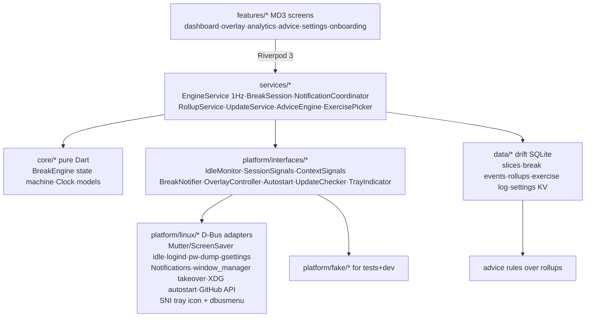

# RestifEye — Knowledge Graph

## 1. Project Abstract
RestifEye (`com.xernai.restifeye`, brand: Xernai) is a free, GPLv3, Linux-first (Fedora Tier-1) break-reminder and digital-wellbeing desktop app in Flutter/Material 3. Situation-aware scheduling (meeting deferral, natural-break credit, pre-break warnings, strict snooze budget) + Wayland-native reliability, with fully local screen-time analytics and rule-based advice. Distribution: GitHub Releases (AppImage + RPM) + github.io site; COPR post-1.0; Flathub blocked by its 2026 AI policy.

## 2. Architecture Graph (Mermaid)

## 3. Module Map
- `lib/core/` — pure-Dart break engine (state machine, monotonic clock, config, models). No Flutter/IO imports; the correctness core (24 tests).
- `lib/platform/interfaces/` — the macOS-port seam; `linux/` D-Bus/XDG/process adapters; `fake/` deterministic test doubles.
- `lib/services/` — orchestration: 1 Hz EngineService tick, break session (exercise pick + window takeover + logging), notifications, rollups, updates, advice rules, exercise picker.
- `lib/data/` — drift schema + repositories (slices, break events, rollups, exercise log, settings KV incl. engine snapshot).
- `lib/features/` — MVVM screens; `lib/app/` — theme tokens, shell, bootstrap wiring.
- `assets/linux/` — desktop entry, AppStream metainfo, SVG icon. `packaging/` — AppImage script + RPM spec. `site/` — github.io landing page. `.github/workflows/` — ci / release / pages.

## 4. Design Decisions
- **2026-07-12 — Product**: two-tier breaks (20-20-20 micro + long), snooze budget→strict overlay with logged 3s hold-to-escape, illustrated exercises, natural-break credit, busy deferral (mic/cam via pw-dump, DND via gsettings) capped 15 min, 30s pre-warn, work hours/days. Top-bar ticker dropped (annoyance + GNOME-extension cost).
- **2026-07-12 — License/distribution**: GPLv3 + trademark on names; DCO for contributions (preserves dual-licensing for future paid Mac build); single public repo; GitHub Releases + COPR later; no Flathub (their AI-code ban, May 2026); site on github.io → move to Cloudflare Pages when Mac sales start (GitHub Pages forbids selling).
- **2026-07-13 — Engine**: deterministic 1Hz-ticked pure-Dart state machine; monotonic clock only for intervals (wall clock only for work-hours/persistence); defer cap measured from immutable cycle-due; deferral exits the moment busy clears; away spans remember lock vs idle; short re-warn after any delayed break; crash-safe wall-clock snapshot restore.
- **2026-07-13 — Riverpod 3 API changes** (from training-data 2.x): `Override` type no longer exported → override lists must stay inferred literals (bootstrap returns instances; helpers build ProviderScope internally). Private named initializing formals (`required this._x`) now valid Dart.
- **2026-07-13 — Test infra**: widget tests use TestHarness (real engine + in-memory drift + fakes). Drift in FakeAsync: never `db.close()` in widget tests (deadlock) and flush unmount timers via `cleanupHarness` as the last body line. AnimationController status listener proved unreliable for completion detection → value listener; GestureDetector needed `HitTestBehavior.opaque` (real bug caught by test).
- **2026-07-13 — Illustrations**: code-drawn CustomPainter animations (theme-aware, GPL-clean, tiny) instead of Lottie/Rive assets.
- **2026-07-13 — Packaging**: AppImage (primary, any distro) + binary RPM from CI bundle (from-source COPR spec = post-1.0); metainfo + desktop + SVG icon in hicolor; release workflow on `v*` tags runs tests → bundle → AppImage + RPM → GitHub Release.
- **Deferred**: wlroots idle (ext-idle-notify-v1 needs native code), fullscreen-app detection (X11-only anyway), weekly advice digest notification, multi-monitor overlay (verify Flutter multi-window API first), dynamic color from wallpaper, COPR from-source spec, Flathub (revisit under their mature-project carve-out someday).

- **2026-07-13 — First live-test fixes (user QA round 1)**:
  - *Single instance*: runner used the Flutter template's `G_APPLICATION_NON_UNIQUE` → every app-drawer launch spawned a full new process (4 windows / 4 warning notifications / 4 overlays / breaks-taken ×4). Fixed with default GApplication flags + present-existing-window in `activate`. This one root cause explained the entire "4×" bug report.
  - *Notification-first controls*: Snooze removed from the overlay (defeats snooze's purpose once the screen is taken); warning notification now has Start now / Snooze / Skip. New `BreakEngine.skip()` with `skipBudget` (default 2 **consecutive** skips, reset on completed/credited break, configurable 0–3 in Settings). New `BreakAction.skipped` (drift intEnum — append-only). Skips deliberately NOT in DailyRollups (schema untouched); revisit if advice rules want skip pressure.
  - *Fullscreen optional*: `flagFullscreenOverlay` (settings KV, default on) → `OverlayController.enterBreak(strict:, fullscreen:)`. Strict breaks always fullscreen. Kept out of `BreakConfig` because `updateConfig` restarts engine timers — presentation flags must not reset schedules.
  - *Tray*: hand-rolled StatusNotifierItem + com.canonical.dbusmenu over the `dbus` package (`platform/linux/sni_tray.dart`) because ayatana-appindicator dev libs aren't a build dep we want (tray_manager needs them; keeps AppImage dependency-free). Icon = ARGB32 pixmaps decoded at runtime from bundled PNGs (`app/tray_icons.dart`). Menu: Open/Pause/Quit; re-registers on watcher restart. GNOME requires AppIndicator extension — documented on site + QA list. `main.dart` now uses ProviderContainer + UncontrolledProviderScope so tray actions can drive `pausedProvider`.
  - *Autostart default-on*: applied once at bootstrap behind `flagAutostartApplied` (never re-forces after user opt-out; skipped in dev mode). One-time "still running in background" notification on first window-hide (`flagHideNoticeShown`).
  - *Dashboard*: `Monitoring` phase now carries `microIn`+`longIn`; card shows the other timer as a secondary line ("Eye break folds into the long break" when merged).
  - 75 tests green (was 71), analyze --fatal-infos clean, release build OK. Landing page rebuilt (sticky nav, hero mock, steps, FAQ, a11y/reduced-motion, dark/light).

- **2026-07-14 — Second live-test round (user QA round 2). Two engine bugs explained four symptoms:**
  - *The trapped user (P0)*: `_trackAway` ran **during** breaks. A movement break is meant to get you off the keyboard, so idling past `idleFireThreshold` made `_resolveAwaySpan` credit an away span **from inside the break** → `_finishCycle` ran, the `inBreak` tick case never did, `BreakCompleted` never fired, and `BreakSessionNotifier` (which only exited the overlay on Completed/Escaped/Snoozed) never released the window. Result: fullscreen + always-on-top + `_inBreak` swallowing `onWindowClose` = an app you cannot quit. Fixed by suspending away-tracking while `inBreak`.
  - *No Snooze button / surprise strict breaks*: the snapshot-restore constructor path never seeded `_snoozesLeft`, leaving it 0. Since `_strictNow = _snoozesLeft <= 0 && strictMode`, **the first break after every login was strict** and its notification carried no Snooze action. Budgets are per-cycle and not persisted, so they are now seeded on every construction path.
  - *Double-credited rest (found by the new test)*: the idle clock runs through a break the user sat out, so backdating `now - idle` measured the break itself as a fresh away span and credited a second break on their return. Added `_awayFloor` — an away span may never be backdated before the last break/pause ended.
- **2026-07-14 — Overlay is now level-triggered, not edge-triggered.** `OverlayController` went from `enterBreak`/`exitBreak` commands to a single idempotent `apply(BreakWindowState)`, driven by `overlayReconcilerProvider` off the engine's 1 Hz **phase** stream. Rationale: any break-ending path that failed to emit the exact expected event stranded the window forever, and two `unawaited` calls could interleave so a late `enterBreak` re-fullscreened *after* an `exitBreak` (leaving `_tookFullscreen=false` while actually fullscreen — unrecoverable). All window mutations now go through one serialized queue; `_current` only advances on success, so a failed transition self-heals on the next tick. Escape hatches added (`Esc` when no break, `Ctrl+Q` always) via a shared `AppLifecycle`.
- **2026-07-14 — Notifications**: `Notify`/`CloseNotification` were fire-and-forget, so a dismiss could overtake the show whose reply carried the id to dismiss → the notification was orphaned, and the next cycle passed its **dead id** as `replaces_id`, making the daemon write into a destroyed slot instead of raising a banner (the "eye break notification doesn't always show" report). Now serialized through one queue, plus a `NotificationClosed` subscription that zeroes `_activeId` so a dead id is never reused. Urgency deliberately stays **normal** (user's call: informational, not an alarm). Still exactly one live notification, still replaced in place within a cycle.
- **2026-07-14 — Sounds** (`SoundPlayer` seam, `LinuxSoundPlayer`): `canberra-gtk-play` → `paplay`/`pw-play` → silent, probed once and cached. No audio plugin, so the AppImage stays dependency-free — same reasoning as the hand-rolled SNI tray. Sound is deliberately *one* mechanism: the D-Bus `sound-name` hint was dropped so there is a single Settings toggle and no two states to drift apart.
- **2026-07-14 — Tray, resolved**: never a code bug. GNOME has shipped no status area since 3.26; the top-right corner is only reachable via a shell extension hosting SNI, so our correct SNI item was drawn by nobody. `GnomeTraySupport` now detects the missing `org.kde.StatusNotifierWatcher`, names the exact extension in Settings, and enables/installs it over `org.gnome.Shell.Extensions` D-Bus on an explicit click. `Brand` (`lib/app/brand.dart`) centralises the app name/id for the pending rename.
- **2026-07-14 — Dev-mode config was untestable**: `micro=1min, long=3min` with a 2-min merge window meant `longDue <= microDue + 2` always held → **eye breaks never fired standalone in dev mode**. Long interval moved to 6 min.
- **2026-07-14 — Timed pause**: `setPausedByUser(bool, {DateTime? until})` with wall-clock auto-resume (wall, not monotonic — "2 hours" means 2 hours of the user's life, across suspend). Presets 30m/1h/2h/3h/indefinite on the Dashboard; persisted so a restart cannot strand you paused.
- **2026-07-14 — Stats**: `computeSliceStats` summed only `active` and **discarded the idle/locked slices it was already recording every second**. Now surfaces idle, away, at-computer, active ratio, and workday span. Drift `schemaVersion` 1→2 with an additive `onUpgrade` (defaults, nullable) so existing history survives.
- **2026-07-14 — Site**: `<section class="wrap">` + `.wrap { padding: 0 24px }` — `.wrap` (0,1,0) outranks `section` (0,0,1), so the **section vertical padding had been silently zeroed all along**; that was the reported "bad margins". Fixed with `padding-inline`/`padding-block` longhands so the rules no longer collide. `site/icon.svg` had a 6.25% transparent inset baked into its viewBox (artwork at 8..120 of a 0..128 canvas), making the mark render small and misaligned — viewBox cropped to `8 8 112 112`. Headings no longer inherit the body's 1.65 prose leading; the synthetic 650 weight is gone.

- **2026-07-15 — Dashboard stats frozen on launch day (user QA round 3)**: "breaks taken stuck on 57 / away == at computer" was one bug with a coincidence on top. `todaySliceStatsProvider`/`todayBreakCountsProvider` (and the analytics/advice range providers) captured `DateTime.now()` **once at provider creation**, so an app left running past midnight showed the launch day's totals forever — 57 was exactly Jul 14's `completed 31 + credited 26`, and Jul 14's at-computer (42 205 s) vs away (42 195 s) both happened to format as "11h 43m". Fixes: (1) `todayProvider` — self-invalidating provider of the local calendar day, re-checked by a 30 s periodic timer (deliberately not one timer aimed at midnight: monotonic timers stall across suspend and would fire hours late); `wallClockProvider` (`DateTime Function()`) is its test seam. All four date-scoped providers now watch it. (2) `watchSliceStats` selects slices **overlapping** the day and clips them to it — the old `startAt`-only filter credited a midnight/suspend-spanning slice wholly to the day it began, silently stealing hours from the next day (affected rollups too, same query). 99 tests green. `fake_async` promoted to a direct dev dependency (timer tests import it).
- **2026-07-15 — Missing app icon after rename**: not a code bug. The dev machine's `~/.local/share` still held the `com.xernai.breaktime` desktop entry + hicolor SVG (Exec pointing at the deleted `Github/breaktime` clone) and nothing had installed `com.xernai.restifeye.svg`, so every surface (shell, dock, notifications, autostart entry) fell back to the generic icon — dev installs are hand-rolled, only RPM/AppImage install the icon. Fixed by installing the new desktop entry + SVG locally and deleting the stale pair. One repo change: `StartupWMClass` in the desktop asset corrected `RestifEye` → `com.xernai.restifeye`, because the runner calls `g_set_prgname(APPLICATION_ID)` so the window class/app-id is the reverse-DNS id — the old hint named a class no window ever has. **Reminder: after any app-id/binary rename, refresh the manual dev install (desktop entry, hicolor icon, autostart Exec).**

## 5. Current State
- **M0–M4 code complete**: engine, data, adapters, overlay+exercises, analytics+advice, updates+autostart, packaging+site+workflows. **133 tests green**, `flutter analyze --fatal-infos` clean, `dart format` clean.
- **2026-07-13 live-verified on Fedora GNOME Wayland**: release build succeeded; app ran 85 s in dev mode (isolated XDG_DATA_HOME), recorded activity, persisted snapshots, and correctly HELD a due break while the user was idle (anti-annoyance behavior observed in the wild). Mutter IdleMonitor and gnome-shell notification daemon confirmed present.
- **Repo**: `github.com/Xern-AI/RestifEye` (renamed from `breaktime` 2026-07-15; both old URLs redirect on github.com — GitHub **Pages does NOT redirect**, the site moves to `xern-ai.github.io/RestifEye`). All baked-in slugs (version.dart update checker, metainfo, RPM spec, site) point to Xern-AI/RestifEye.
- **Remaining before v0.1.0 tag**: user re-runs docs/qa-checklist.md (new items: single-instance relaunch, Skip action + budget, windowed breaks, tray menu, autostart default) then `git tag v0.1.0 && git push --tags`.
- **RENAME EXECUTED 2026-07-15 — the app is RestifEye** (superseded the 2026-07-13 shortlist Fermata/Pausely/Unclench/Restio/Lull, never verified). Casing scheme: display + binary + artifacts `RestifEye` (RPM Name, AppImage, `/opt/RestifEye`, `Exec=`); app id **lowercase** `com.xernai.restifeye` (also `StartupWMClass=`, since `g_set_prgname(APPLICATION_ID)` makes it the real window class) (desktop/metainfo/icon basenames match); Dart package `restifeye` (lowercase is compiler-enforced); env var `RESTIFEYE_DEV`; repo slug `Xern-AI/RestifEye`. `AppDatabase.open()` does a one-shot legacy migration (`~/.local/share/breaktime/breaktime.db[-wal/-shm]` → `RestifEye/RestifEye.db`). Uncommitted; email `xernaitech@gmail.com` alias not yet created; restifeye.com/.app/.io still unregistered; USPTO TESS check still open.
- **Names verified & rejected 2026-07-15**: *Cessation* (clinical/permanent-stop connotation, no check needed). *Respite* — FATAL: getrespite.app is an upcoming Mac break-reminder app with the exact name+category (and Mac is our future paid platform); respite.app registered; crates.io taken. *Interlude* — crowded: App Store already has "Interlude: End Phone Addiction" and "Interlude – Mindful Wait" (both digital-wellbeing/break apps → weak trademark position in-class); interlude.app parked on Atom.com marketplace (premium price); interludeapp.com taken; crates.io taken; pub.dev free; no dominant GitHub repo. USPTO full TESS search still not done for any candidate.
- **Restifeye (user's coinage, verified 2026-07-15)**: PASSES all availability checks — zero web hits, GitHub 0 repos, pub.dev free, crates.io free, App Store 0 results, restifeye.com/.app/.io all unregistered. Risks flagged: (1) mishearing/misspelling lands on "Restify" — an existing Play Store screen-time app (com.restify) in our exact category, plus the restify.js Node framework; (2) spelling/pronunciation ambiguity hurts word-of-mouth; (3) "-eye" suffix undersells non-eye features (posture breaks, analytics). USPTO TESS formality still open but coined term + zero web presence = low risk. Registering the domains is cheap insurance if the user is leaning this way.

- **2026-07-18 — Snooze budget was per-*engine*, not per-*kind* (user QA round 4)**: a 3-snooze budget could be stretched to 5 on a long break. `_snoozesLeft` was one global counter, but micro and long run independent, interleavable cycles. Snoozing a long break pushes `_longDue` past `_microDue + _mergeWindow`, so `_nextKind()` flips to the already-due micro break, which fires in the gap; completing that micro cycle refilled the shared counter and handed the still-pending long break a fresh budget on top of what it had spent. Now `Map<BreakKind,int>`, refilled only by that kind's own `_finishCycle` (a long break still refills micro, because it genuinely restarts that cycle). Second half of the fix: `_resetDue` no longer refills the budget as a **side effect of rescheduling a timer** — an SRP violation that made any micro reschedule silently rearm a pending long break. Budget changes now live only at real cycle boundaries, so the three resume paths (pause, work hours, `updateConfig`) refill explicitly.
- **2026-07-18 — Media/fullscreen pause (`PresentationSignals`)**: breaks hold while something on screen must not be interrupted. Built on **idle inhibitors, not audio** — video players, browsers in fullscreen video, presentation tools and games all take one so the screen never blanks; music players do not, so a background playlist can't suppress breaks all day. Two sources unioned: gnome-session `IsInhibited(8)` (where `org.freedesktop.ScreenSaver.Inhibit` lands on GNOME; `GetInhibitors`→`GetAppId` also names the app) and logind `ListInhibitors` filtered to `mode == block` + `what` containing `idle` (desktop-independent fallback). **Both verified live** on Fedora GNOME Wayland against a real `ScreenSaver.Inhibit` and a `systemd-inhibit --what=idle`. Deliberately a *pause*, not the busy/deferral path — a film outlasts any sane `deferCap`, and a cap would guarantee the interruption the feature prevents. Two semantics worth remembering: (1) **timers are not reset on resume** — the monotonic interval keeps running down during playback, because two hours of video is still two hours of screen time and a film must not buy a fresh 20 minutes; an overdue break arrives via the existing `_rewarn` short lead rather than seizing the screen as the credits roll. (2) A break already on screen is **left to finish** — abandoning it would log a `BreakEscaped` the user never earned. `Paused` gained a `PauseReason` (user/workHours/media, precedence in that order) + `byApp`. TTL/in-flight caching was generalised out of `ContextSampler` into `PolledValue<T>`; the presentation sampler polls unconditionally (the pause must engage while the film plays, which is exactly when no break is near) while busy-probing stays gated on break proximity.
- **2026-07-18 — Expressive tray icon (`core/mood/` + `TrayMoodPresenter`)**: the icon carries a face whose colour AND shape track how the day is going. Colour is never the only signal — every mood changes eyes or mouth too, for colour-vision deficiency and monochrome tray themes — and the SNI `ToolTip` states the mood in words, because a red icon with no explanation is just anxiety. The mark's two pause bars were already readable as eyes, which is what made this possible without abandoning the brand. Faces are **drawn at runtime** with `PictureRecorder` → `rawStraightRgba` → ARGB32 (7 moods × 2 sizes would be 14 assets to keep in sync, and the pulse needs in-between frames); the bundled `assets/icons/tray_*.png` and `app/tray_icons.dart` are **gone**. SNI hosts cache icons, so `update()` must emit `NewIcon`/`NewToolTip` or nothing visibly changes. Rules run over a **rolling window of recent break responses**, not day totals — totals mean one bad morning colours the icon red until midnight and a good afternoon can never earn its way back. `MoodTracker` adds **asymmetric hysteresis: praise quickly, scold slowly** (improvement adopted at once, worsening must persist 3 samples), without which the icon flickers as breaks roll through the window. A snooze is not counted as a miss until habitual — it's a deferral the app itself offers. The window is persisted (`mood_recent`) so restarting isn't a way to clear a warning. Animation is a 4-frame acknowledgement on change, never an idle loop: every frame is a D-Bus signal plus a host re-read. `MoodService` (what the app feels) is split from `TrayMoodPresenter` (how it looks) so only the second half needs a rendering pipeline. **Regenerate the face contact sheet** by rendering `renderTrayFace` for each `Mood` into a canvas in a throwaway test and writing the PNG to /tmp — that is how the `tired` lids were caught reading as *angry* (both sloped the same way; they must mirror, drooping outward).
- **2026-07-18 — Break no longer leaves the window on screen**: `WindowTakeover` samples `isVisible()` on the way *into* a break and restores it on the way out, so a break that started from the tray ends back in the tray instead of leaving the app in the user's face to be dismissed by hand. Guarded on the `leaving` transition so `forceRestore()` can never hide a window the user opened themselves; an unreadable visibility is treated as "was visible" (a window left open is recoverable, a hidden one the user was using is not).
- **2026-07-18 — Exercise intensity + deck 12→24**: every exercise carries `ExerciseIntensity` (soft/medium/heavy) with a user ceiling in Settings, default medium. It's a physical constraint, not a taste: squats are impossible in an open-plan office, and an overlay suggesting the impossible teaches people to dismiss overlays. When opt-outs and the ceiling together leave nothing, **opt-outs yield first**. Ten new illustrations came from extending the shared `_figure` primitive (fold/twist/legBend/kneeLift/stance/armsUp) rather than new painters, so a squat bends visible knees instead of shrinking. Two bugs found only by rendering frames and looking: jumping-jack arms swept past vertical and drew through the head, and rooting arms at the spine grazed it even after clamping — arms now hang from shoulder width and peak at ~43°. The art→painter switch was collapsed from 12 near-identical blocks to one line per art (would have been 22) while keeping compile-time exhaustiveness. Exercise ids stay append-only (the exercise log references them).

- **2026-07-19 — The mood icon was invisible, and it was one line (user QA round 5)**: reported as "tray icon is tiny and shows no colour or animation". Both symptoms, one cause. `_SniItemObject` advertised `'IconName': Brand.appId`, and the SNI spec has hosts **prefer `IconName` and fall back to `IconPixmap` only when it is blank** — so GNOME drew the installed hicolor SVG and never once read the pixmaps. Diagnosed live off the bus rather than guessed: the item's `ToolTip` already read *"Breaks are slipping — try taking the next one"* and `IconPixmap` carried 69 KB at 24/48 px, proving the whole mood pipeline worked and only the host's icon choice was wrong. "Tiny" was the same SVG's 6.25% transparent inset — the identical defect fixed in `site/icon.svg` on 2026-07-14 but never fixed in `assets/linux/com.xernai.restifeye.svg`, whose viewBox is now cropped to `8 8 112 112` too (helps dock/notifications as well). Three follow-ons: `IconName` is now `''` permanently (**pixmaps are the icon; nothing may outrank them**); the tray face dropped the launcher's 6.25% margin to 4%, since the panel adds its own padding and stacking the two is what made it read small; and `_traySizes` went from `[24,48]` to `[22,24,32,48,64]` so a panel asking for 22 or 32 gets a crisp match instead of a rescale — starting at 22 because below that the strokes fall under a pixel and a host naively taking the first entry would draw mush. **Testing affordance**: real moods move over hours, so `TrayMoodPresenter.startDemo()` cycles all seven every 5 s under `RESTIFEYE_DEV=1`. Regression tests pin the minimum size and that the face reaches within 2 px of the pixmap edge.
