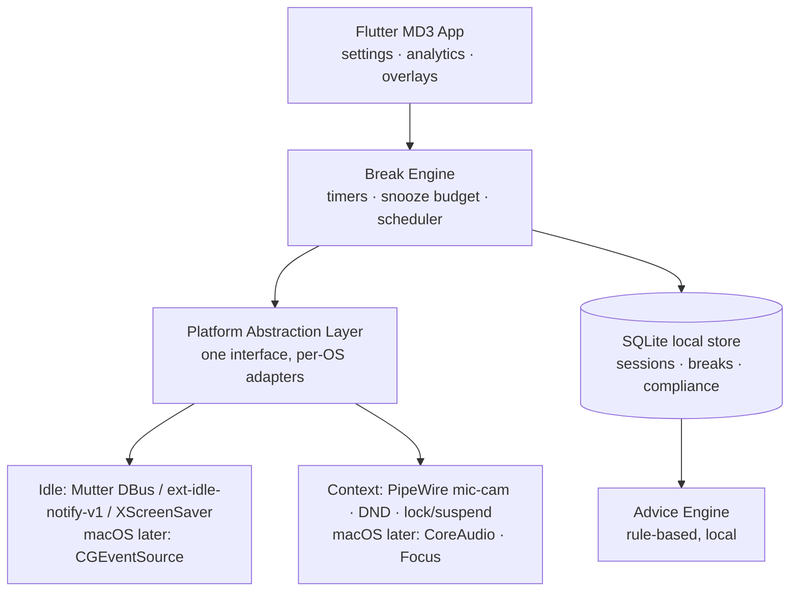

# BreakTime — Knowledge Graph

## 1. Project Abstract
BreakTime is a Linux (Fedora-first) break-reminder and digital-wellbeing app: configurable eye/health break intervals, limited snooze with escalating enforcement, randomized illustrated exercises per break, automatic screen/work-time tracking with weekly/monthly/yearly analytics and rule-based advice, and a top-bar countdown ticker. Material Design 3 UI. Core thesis: situation-aware scheduling + Wayland-native reliability, because competitors fail on interruption timing and Wayland support.

## 2. Architecture Graph (Mermaid)

## 3. Module Map
- (empty repo — no modules yet; structure to be defined in implementation plan)
- `docs/` — project documentation and this knowledge graph.

## 4. Design Decisions
- **2026-07-12 — Feature scope proposed (pending user approval):**
  - Two-tier breaks: 20-20-20 micro eye breaks + long breaks; independent intervals.
  - Snooze budget with escalating friction; post-budget full-screen multi-monitor overlay; 3s long-press emergency escape (logged, counted against compliance) instead of a zero-escape hard lock.
  - Exercise deck: curated illustrated micro-exercises (Rive/Lottie), weighted no-repeat shuffle, per-exercise blacklist for accessibility.
  - Automatic tracking only (idle-monitor derived); local-first SQLite; no cloud/accounts.
  - Rule-based advice engine over local data (no LLM/cloud).
  - Differentiators: natural-break credit (away-time/lock/suspend counts as break), do-not-interrupt intelligence (PipeWire mic/camera in use, DND, fullscreen — deferral capped ~15 min), 30s pre-break warning toast, work-hours/quiet-hours window.
  - Top-bar ticker requires GNOME Shell companion extension (GJS, DBus to main app); SNI tray elsewhere. Architectural requirement from day one.
  - Wayland-first: idle via org.gnome.Mutter.IdleMonitor / ext-idle-notify-v1 / XScreenSaver behind one abstraction; monotonic-clock timing; crash-safe timer state.
  - Deferred (anti-feature-creep): cloud sync, gamification beyond streaks, Pomodoro, calendar integration, team features, mobile, plugins.
- **2026-07-12 — Stack leaning (not final):** Flutter Linux desktop for MD3 fidelity. Verified 2026-07-12: Flutter desktop stable; Canonical is lead maintainer of Flutter desktop since Google I/O 2026; multi-window API landed (usable for multi-monitor overlays). Verify exact package versions at implementation time.
- **2026-07-12 — Top-bar ticker DROPPED (user decision):** persistent ticker risks annoyance; removal also eliminates the GNOME Shell extension (GJS) codebase entirely — major simplification. Countdown lives in the app window and the 30s pre-break toast only.
- **2026-07-12 — Distribution (researched):** Flathub is NOT viable — its May 29, 2026 policy rejects new submissions containing AI-generated/AI-assisted code (carve-out only for mature pre-existing projects). Plan instead: (1) AppImage + RPM on GitHub Releases, (2) Fedora COPR repo for `dnf install`, (3) optionally self-hosted Flatpak remote (.flatpakref) on our own landing page (GitHub Pages). Own-page distribution is fully legal/normal on Linux.
- **2026-07-12 — macOS strategy (researched):** Flutter macOS stable → UI carries over; port cost is platform adapters in Swift (idle via CGEventSource, mic/cam via CoreAudio, overlays via NSWindow levels, login item via SMAppService) + Apple Developer Program ($99/yr, required for notarization) + Mac hardware. Estimated ~20–30% of total effort IF platform abstraction layer is built from day one (now a hard architectural requirement). Paid-Mac model validated by market: LookAway ($15–19 one-time, Mac-only, successful), Time Out (freemium). Licensing note: fully open-source (GPL/MIT) means anyone may rebuild the Mac app free; acceptable in practice (convenience + signed binary is what's paid for) or use open-core.

- **2026-07-12 — Licensing FINAL (supersedes earlier closed-source decision same day):**
  - **GPLv3** for the app + **trademark kept on the app name/brand** (forks may not use the name). Chosen over PolyForm-NC: true open source, community trust, and it reopens Fedora COPR. Commercial forks are legal but must stay GPL/open and rebrand — free original + brand + update stream is the moat.
  - **Contributions require DCO sign-off** (or CLA) so the sole copyright holder retains dual-licensing rights → future paid closed macOS build stays legal.
  - **Single public repo `breaktime`:** app source + landing page (github.io) + GitHub Releases (binaries). No two-repo split needed anymore.
  - **Distribution:** GitHub Releases (AppImage primary + RPM) **and COPR** (now allowed under GPL — native `dnf install` + auto-updates for Fedora). In-app update notifier via GitHub Releases API for AppImage users. Flathub still blocked (AI policy). No self-hosted infrastructure.
  - Privacy stance: all data local, no network calls except update check — state loudly on site/README.
- **2026-07-12 — Mac monetization plan (roadmap-only, build only if demand proven):**
  - One-time purchase. GitHub Pages prohibits selling (e-commerce/"primarily commercial" sites; donations OK) → at Mac launch, move site hosting from github.io to Cloudflare Pages/Netlify free tier — same repo, same static site, just a different deploy target; trivial migration.
  - Sales via Merchant of Record (Paddle / Lemon Squeezy / Gumroad — handles global VAT/sales tax) → hosted checkout → license key emailed → app validates key offline; unlicensed app runs in trial/locked mode. DMG can still be downloaded from GitHub Releases since the gate is the license key, not the download.
  - Mac App Store remains an optional second channel later (Apple 15% small-business cut).

## 5. Current State
- Ideation/decisions phase. Feature set proposed; licensing (GPLv3 + trademark + DCO), distribution (GitHub Releases + COPR), and Mac-roadmap decisions locked. Awaiting feature-set approval, then implementation planning.
- No code, no git repo yet (`git init` pending). Single public repo: source + github.io site + releases.
